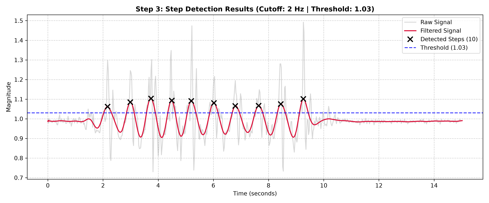

# Step Counter Using IMU Data

A wearable step-counting system based on an **MPU6050 6-DOF IMU**, **Arduino UNO**, and **Python-based digital signal processing**.

The system acquires acceleration data during human walking and running, processes the measured signal, detects gait-related peaks, and estimates the number of steps using threshold-based peak detection. The project also investigates the effect of sensor placement and gait condition on step-counting performance.

---

## Overview

This project was developed as part of the **Measurement and Control Systems** course at the Department of Mechanical Engineering, Sharif University of Technology.

The main objective was to design, implement, and experimentally evaluate a low-cost embedded step counter using inertial measurement data.

The complete processing workflow is:

```text
MPU6050 IMU
     ↓
Arduino UNO
     ↓
Acceleration Data Acquisition
     ↓
Python Data Processing
     ↓
Digital Filtering
     ↓
Threshold Selection
     ↓
Peak Detection
     ↓
Step Count
     ↓
Experimental Evaluation
```

The project includes experimental data collected under different **gait conditions** and **sensor placements**.

---

## Key Features

* 6-axis inertial measurement using the MPU6050
* Arduino-based acceleration data acquisition
* Approximately 50 Hz sampling frequency
* Acceleration magnitude calculation from three axes
* Digital low-pass filtering using a Butterworth filter
* Zero-phase filtering using `filtfilt`
* Threshold-based step detection
* Peak detection using `scipy.signal.find_peaks`
* Experimental threshold selection
* Evaluation under walking and running conditions
* Comparison of waist- and neck-mounted sensor placements
* Statistical evaluation of step-counting performance

---

## Hardware

The experimental setup consists of:

| Component    | Description                           |
| ------------ | ------------------------------------- |
| Arduino UNO  | Microcontroller and data acquisition  |
| MPU6050      | 6-DOF accelerometer and gyroscope IMU |
| Breadboard   | Prototyping                           |
| Jumper wires | Electrical connections                |

### MPU6050 Configuration

The accelerometer was configured with a measurement range of **±2 g**, corresponding to a sensitivity of approximately **16384 LSB/g**.

The MPU6050 communicates with the Arduino through the **I²C interface**.

| MPU6050 | Arduino UNO |
| ------- | ----------- |
| VCC     | 5V / 3.3V   |
| GND     | GND         |
| SDA     | A4          |
| SCL     | A5          |

The default I²C address used by the sensor is `0x68`.

---

## Data Acquisition

The Arduino reads the three accelerometer axes:

* `Ax`
* `Ay`
* `Az`

The acceleration magnitude is calculated as:

```text
A = sqrt(Ax² + Ay² + Az²)
```

The system operates at approximately **50 Hz**, with a sampling interval of approximately **20 ms**.

The measured data are transmitted through the Arduino serial interface at **115200 baud** and recorded for subsequent processing in Python.

---

## Experimental Setup

The experiments investigated the effect of **sensor placement** and **gait condition** on step detection.

### Waist-Mounted Sensor

The sensor was mounted around the waist/abdominal region for experiments involving:

* Walking
* Running

These experiments were used to evaluate step detection under different gait conditions.

### Neck-Mounted Sensor

Additional walking experiments were conducted with the IMU mounted near the back of the neck.

This setup was used to investigate step detection with a different sensor placement.

---

## Signal Processing

### 1. Raw Acceleration

The raw acceleration magnitude contains the periodic components associated with human gait together with high-frequency noise and small body/sensor vibrations.

Typical measurements showed a baseline close to **1 g**, with walking-related peaks reaching approximately **1.4 g** in some trials.

---

### 2. Low-Pass Filtering

Several filtering approaches were investigated, including:

* Moving average filtering
* Chebyshev filtering
* FIR filtering
* Butterworth filtering

A **3rd-order low-pass Butterworth filter** was selected for the main processing pipeline.

Different cutoff frequencies were investigated, including:

* 1 Hz
* 2 Hz
* 3 Hz
* 4 Hz

A cutoff frequency of **2 Hz** was selected as the baseline configuration for the main step-detection algorithm.

Zero-phase filtering was performed using:

```python
scipy.signal.filtfilt
```

This filtering approach avoids introducing a phase shift into the processed signal.

---

### 3. Threshold Selection

Multiple walking trials were used to investigate an appropriate detection threshold.

The baseline threshold selected for the main processing configuration was:

```text
Threshold = 1.03 g
```

The threshold was combined with a minimum peak-distance constraint to reduce false detections caused by small fluctuations in the signal.

---

### 4. Peak Detection

Steps were identified using peak detection with:

```python
scipy.signal.find_peaks
```

The baseline minimum distance between detected peaks was:

```text
Minimum peak distance = 0.35 s
```

The detected peaks were then used to estimate the total number of steps in each trial.

---

## Step Detection Parameters

The main processing configuration was:

| Parameter             |                          Value |
| --------------------- | -----------------------------: |
| Sampling frequency    |                          50 Hz |
| Filter                | 3rd-order Butterworth low-pass |
| Cutoff frequency      |                           2 Hz |
| Detection threshold   |                         1.03 g |
| Minimum peak distance |                         0.35 s |
| Peak detection        |      `scipy.signal.find_peaks` |

For the evaluated running condition, the processing parameters were adjusted experimentally. One running test used a **3 Hz cutoff frequency** and a **1.05 g threshold**.

---

## Experimental Results

The system was evaluated using multiple walking and running trials.

According to the experimental analysis:

* **14 trials** were included in the statistical evaluation.
* A total of **152 steps** were evaluated.
* Mean Absolute Error (MAE): approximately **0.286 steps/trial**
* Root Mean Square Error (RMSE): approximately **0.535 steps/trial**
* Mean Absolute Percentage Error (MAPE): approximately **2.64%**
* **10 out of 14 trials (71.4%)** produced an exact step count.
* The aggregate counting accuracy calculated from the reported absolute errors was approximately **97.37%**.

### Neck-Mounted Experiments

For the neck-mounted walking experiments, the reported results were:

```text
40 detected steps / 40 actual steps
```

These trials produced zero counting error under the tested conditions.

### Example: Test 8 — Waist-Mounted Walking

The following figure shows the step-detection result for **Test 8**, in which the sensor was mounted around the waist/abdominal region.

The plot shows:

* Raw acceleration magnitude
* Filtered acceleration signal
* Detection threshold
* Detected step locations



In this example, the processing pipeline detects **10 steps** using a **2 Hz cutoff frequency** and a **1.03 g threshold**.

---

## Limitations

The experimental results also revealed several limitations:

* Soft-tissue motion can introduce additional acceleration components.
* Sensor movement or imperfect attachment can affect the measured signal.
* MEMS sensor noise and bias drift may influence the measurements.
* Wired serial communication introduces a small acquisition latency.
* Gait initiation and termination can produce boundary-related counting errors.
* Fixed detection parameters may not perform equally across all walking and running conditions.

---

## Repository Structure

The repository contains the experimental datasets, processing code, results, images, videos, and complete project report.

The `Data` directory contains the datasets collected under the three main experimental conditions:

1. **Walking with the sensor mounted around the waist/abdomen**
2. **Walking with the sensor mounted near the neck**
3. **Running with the sensor mounted around the waist/abdomen**

Each experimental dataset is accompanied by its corresponding processing code and results.

In addition, **Test 8**, which corresponds to a waist-mounted walking experiment, has been organized separately as an example dataset with its associated results.

```text
imu-step-counter/
│
├── Arduino/
│   └── Arduino firmware and sensor acquisition files
│
├── Data/
│   ├── Waist-mounted walking data
│   │   ├── Experimental datasets
│   │   ├── Processing code
│   │   └── Corresponding results
│   │
│   ├── Neck-mounted walking data
│   │   ├── Experimental datasets
│   │   ├── Processing code
│   │   └── Corresponding results
│   │
│   └── Waist-mounted running data
│       ├── Experimental datasets
│       ├── Processing code
│       └── Corresponding results
│
├── Images/
│   └── Experimental setup images
│
├── Python/
│   └── Python data processing and analysis scripts
│
├── Report/
│   └── Complete project report
│
├── Results/
│   └── test8/
│       └── Example results for Test 8
│
├── Videos/
│   └── Experimental demonstration videos
│
└── README.md
```

The repository structure preserves the relationship between **experimental data, processing code, and corresponding results**.

---

## Software Requirements

The Python processing pipeline uses scientific computing and data-analysis libraries including:

```text
Python
NumPy
Pandas
Matplotlib
SciPy
PySerial
```

The main signal-processing functions are provided through `scipy.signal`.

---

## How to Run

### 1. Install Python Dependencies

Install the required Python packages:

```bash
pip install numpy pandas matplotlib scipy pyserial
```

### 2. Acquire Experimental Data

The Arduino firmware is used to communicate with the MPU6050 and stream acceleration measurements through the serial interface.

The resulting measurements can be recorded as CSV data for subsequent processing.

### 3. Process the Data

Open the relevant Python processing script from the `Python/` directory or the corresponding experimental dataset directory.

The processing pipeline performs:

1. Data loading
2. Data cleaning
3. Raw signal visualization
4. Butterworth filtering
5. Filtered signal visualization
6. Threshold-based peak detection
7. Step counting
8. Visualization of detected steps

The processing parameters can be modified in the Python script to evaluate different gait conditions.

---

## Results and Visualization

The repository contains processed signal plots illustrating:

* Raw acceleration magnitude
* Filtered acceleration signal
* Detected step locations

These plots provide a visual representation of the signal-processing pipeline and the relationship between acceleration peaks and estimated steps.

The example Test 8 result is shown above in the **Experimental Results** section.

---

## Course Information

**Course:** Measurement and Control Systems
**Department:** Mechanical Engineering
**University:** Sharif University of Technology
**Semester:** Spring 2026

---

## Author

**Sadra Safaei**

Mechanical Engineering
Sharif University of Technology
